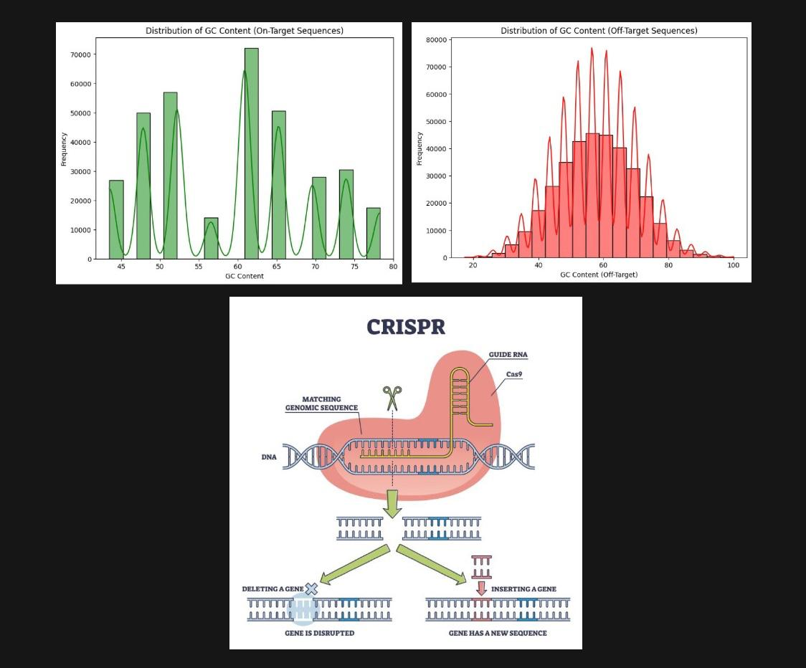
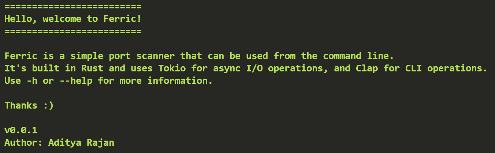
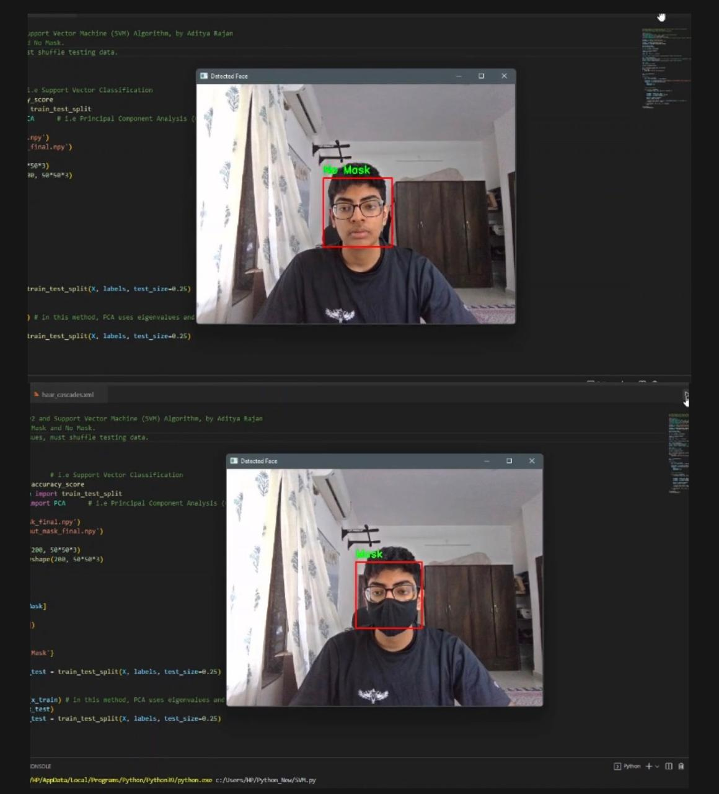
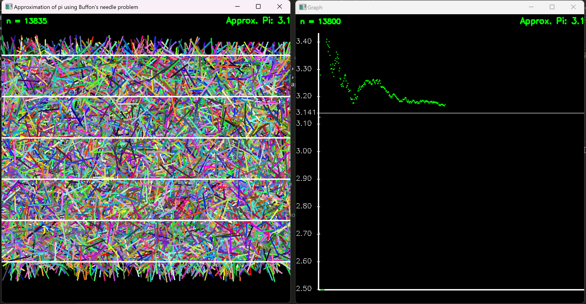

<h2 style="color: #3b6694;">About Me</h2>

Hello! I’m Aditya, a sophomore at UIUC studying Statistics & CS. I'm passionate about building intelligent systems, solving complex data problems, and learning about the applications of AI/ML in medicine and biology. 

Please find out more through [my resume.](images/resume.pdf)

<h2 style="color: #3b6694;">Education</h2>
B.S. Statistics and Computer Science, University of Illinois at Urbana-Champaign (_Expected May 2026_)

<h2 style="color: #3b6694;">Work Experience</h2>
**ML Intern @ Madhya Pradesh State Electronics Development Corp. (_May 2024 - June 2024_)**
- Analyzed family registration data to integrate registration processes with the state government’s Single-Citizen Database (Samagra ID) for ~24 million   registered citizens.
- Implemented video-based KYC for the ongoing Samagra e-KYC project using PyTorch.
- Assisted with automating state and national ID linking for state citizens.
- Learnt about internal ticketing software and procedures.

<h2 style="color: #3b6694;">Projects</h2>

[**CRISPR-Cas9 Off-Target Prediction**](https://github.com/ad1tya-rajan/CRISPR-ML)

- Engineered a data analysis pipeline (processing, feature extraction, EDA) for a dataset of 340,000+ gRNA sequences, extracting relevant features (e.g., GC 
  content, sequence length, Levenshtein distance) to optimise model performance
- Developed and evaluated baseline predictive machine learning models (Logistic Regression, XGBoost), achieving ROC-AUC scores exceeding 0.93 and a accuracies of ~98%
- Created a modern transformer-based architecture to use Positional Encoding and Multi-Head Attention during gRNA sequence analysis
- Implemented sequence-to-numeric transformations (one-hot encoding) to retain critical sequence information for ML applications

  

[**Ferric - Network Port Scanning CLI Tool**](https://github.com/ad1tya-rajan/Rust-Ferric-Port-Scanner)

- Created a user-oriented, nmap-like CLI tool that scans network ports (TCP, HTTP, etc.) in Rust
- Implemented multithreading, asynchronous code, logging & error handling for optimization
- Analyzed Rust networking documentation, crate management & production methods
- Understood fundamentals of networking & cybersecurity applications

  

[**A-Star Search Algorithm Visualizer**](https://github.com/ad1tya-rajan/Rust-Ferric-Port-Scanner)
  
- Developed an interactive visualization tool for A* Search Pathfinding Algorithm in Python
- Implemented A* Graph Traversal and Search in Python to find the Single-Source Shortest Path (SSSP) in a user-generated maze-like graph
- Recorded mouse events & built responsive UI elements with the Pygame library

  

[**Real-time COVID-19 Facemask Detection Model**](https://github.com/ad1tya-rajan/python-projects)
  
- Created a real-time COVID-19 facemask detection tool using webcam input and machine learning
- Implemented the Support Vector Machines (SVM) machine learning algorithm with Scikit-Learn and achieved an accuracy of 96.2%
- Used OpenCV to handle computer vision, real-time webcam input and supplementary data collection

  

[**Buffon's Needle Mathematical Puzzle Simulation**](https://github.com/ad1tya-rajan/python-projects)
  
- Developed Python code to simulate Buffon's Needle (a mathematical problem used to approximate the value of pi)
- Calculated optimal randomisation strategies for 'needle tossing' to effectively simulate the problem
- Created responsive UI elements to display needle tosses, track observed values of pi and show convergence to the true value of pi

 
  
---

<h2 style="color: #3b6694;">Skills</h2>

- **Programming Languages**: C++, Python, Rust
- **Frameworks and Tools**: PyTorch, TensorFlow, NumPy, Tokio, Clap
- **Mathematical Experience**: Multivariable Calculus, Linear Algebra, Statistical Analysis
- **Other Interests**: Computational Biology, Bioinformatics, ML in Information Security

---

<h2 style="color: #3b6694;">Contact Me</h2>

Feel free to reach out if you’d like to collaborate or discuss interesting ideas:

- **Email**: [rajan9@illinois.edu](mailto:rajan9@illinois.edu)
- **GitHub**: [ad1tya-rajan](https://github.com/ad1tya-rajan)
- **LinkedIn**: [Aditya Rajan](https://www.linkedin.com/in/aditya-rajan-b0a668336/)

---

Thanks for visiting my portfolio :)
